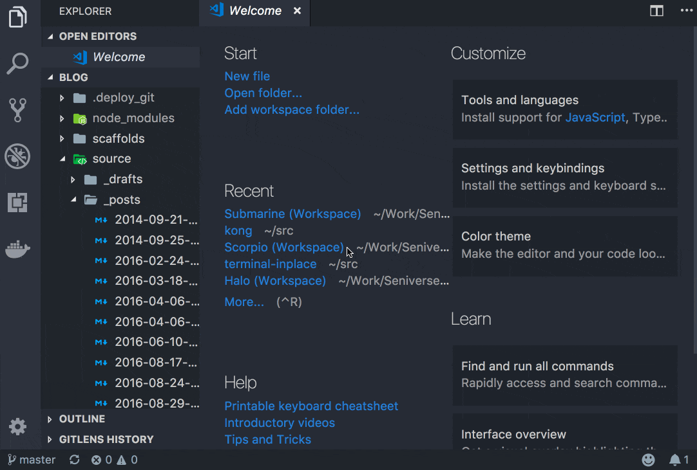

# Terminal In Place

[VSCode Extension] Launch your own vscode terminal in the directory of your focus file.

## Usage

There are 2 ways to use this extension in [VSCode](https://code.visualstudio.com/):

1. Use shortcut **<code>alt+ctrl+&#96;</code>** to launch an inner terminal whose current working directory is the directory in where your open focus file stays. As we all know, by default in VSCode, <code>ctrl+&#96;</code> can toggle the inner terminal and this is unchanged. That's to say, by adding an `alt`, we make a candy for the inner terminal in VSCode.
2. Open Command Palette in VSCode and find `Terminal In Place` command to execute.

If your open focus file stays in an existing directory, the terminal would `cd` to that directory automatically. Otherwise(the _Welcome Page_ of VSCode just lays in an inexistent or a temporary directory), a standard inner terminal would be created.

See the snippet:

## Installation

1. Open [Visual Studio Code](https://code.visualstudio.com/)
2. Press `Ctrl+P` to open the Quick Open dialog
3. Type `ext install Terminal In Place` to find the extension
4. Click the `Install` button, then the `Enable` button

OR

1. Open the Extensions tab in [Visual Studio Code](https://code.visualstudio.com/)
2. Type `Terminal In Place` to find the extension
3. Click the `Install` button, then the `Enable` button

## LICENSE

[GPLv3](./LICENSE)
